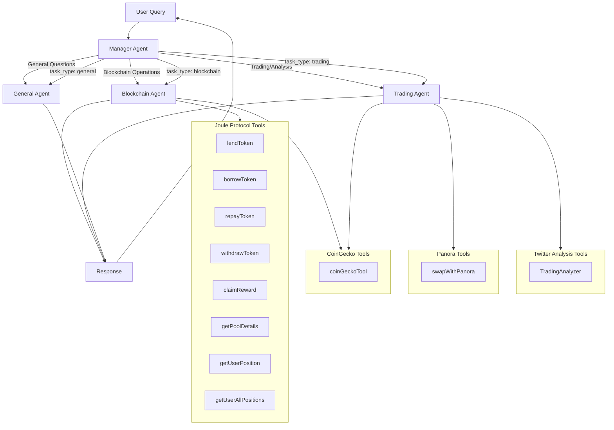

# Kaisen-Assistant

## Overview
Kaisen-Assistant is an advanced multi-agent system designed to handle specialized tasks across blockchain operations, trading analysis, and general queries. Powered by sophisticated natural language processing, the platform leverages a comprehensive suite of blockchain tools including Joule Protocol for DeFi operations, Panora for cross-chain trading, Twitter sentiment analysis for market intelligence without API dependencies, and CoinGecko integration for Aptos-chain token verification. The system utilizes a manager-agent architecture to intelligently route user queries to the appropriate specialized agent based on intent recognition, ensuring efficient and accurate responses while maintaining seamless context across complex blockchain interactions.

## Live Demo 
Try Kaisen-Assistant now: [Live Demo](https://twitter-move.vercel.app/)

## Architecture
The system follows a hub-and-spoke architecture:

1. **Manager Agent**: The central hub that receives all user queries and determines which specialized agent should handle each request
2. **Specialized Agents**:
   * **Blockchain Agent**: Handles all blockchain operations using Joule Protocol tools
   * **Trading Agent**: Processes trading and analysis requests using Panora and Twitter analysis tools
   * **General Agent**: Responds to general questions and informational queries

## Tools Integration
Kaisen-Assistant integrates with various tool sets:

### Joule Protocol Tools
* `lendToken`: Facilitates token lending
* `borrowToken`: Enables token borrowing
* `repayToken`: Handles loan repayments
* `withdrawToken`: Manages token withdrawals
* `claimReward`: Processes reward claims
* `getPoolDetails`: Retrieves information about liquidity pools
* `getUserPosition`: Fetches user position details
* `getUserAllPositions`: Gets all positions for a given user

### Panora Tools
* `swapWithPanora`: Executes token swaps via Panora

### Twitter Analysis Tools
* `TradingAnalyzer`: Analyzes Twitter sentiment for trading insights without API

### CoinGecko Tools
* `coinGeckoTool`: Fetches official token contract addresses across multiple blockchains from CoinGecko with or without API

## Flow Process
1. User submits a query
2. Manager Agent categorizes the request type:
   * `task_type: blockchain` → Blockchain Agent
   * `task_type: trading` → Trading Agent
   * `task_type: general` → General Agent
3. Specialized agent accesses required tools
4. Response is generated and returned to the user

## Visualization
The system architecture can be visualized using the Mermaid flowchart below:



## Getting Started
```bash
# Install dependencies
npm install

# Configure your API keys
cp .env.example .env
# Edit .env with your API keys for Joule Protocol, Panora, Twitter, and CoinGecko

# Start the assistant
npm run dev
```

## Usage Examples

### Blockchain Operations
```javascript
// Example: Lending tokens via Joule Protocol
const response = await kaisenAssistant.query(
  "I want to lend 100 APT tokens on Joule Protocol"
);
```

### Trading Operations
```javascript
// Example: Executing a token swap via Panora
const response = await kaisenAssistant.query(
  "Swap 50 USDT for APT using the best available rate"
);
```

### Market Analysis
```javascript
// Example: Analyzing market sentiment
const response = await kaisenAssistant.query(
  "What's the current Twitter sentiment for Aptos?"
);
```

### Token Address Lookup
```javascript
// Example: Looking up token addresses across blockchains
const response = await kaisenAssistant.query(
  "What's the official contract address for USDC on Aptos and Ethereum?"
);
```

## CoinGecko Integration
The CoinGeckoTool provides cross-chain token address verification:

```javascript
// Example: Fetching a token's address on a specific chain
const aptosUSDC = await coinGeckoTool.invoke({
  tokenName: "USDC",
  chain: "aptos"
});

// Example: Fetching a token's addresses across all available chains
const allUSDCAddresses = await coinGeckoTool.invoke({
  tokenName: "USDC"
});
```

Features of the CoinGecko integration:
- Supports all major blockchains (Ethereum, Solana, Aptos, Polygon, etc.)
- Provides official token contract addresses to prevent scams
- Handles token name and symbol search
- Groups results by blockchain for clear reporting

## Configuration
Kaisen-Assistant can be configured through the `config.json` file:

```json
{
  "defaultAgent": "manager",
  "apiTimeoutMs": 5000,
  "enabledTools": {
    "jouleProtocol": true,
    "panora": true,
    "twitterAnalysis": true,
    "coinGecko": true
  }
}
```

## Contributing
1. Fork the repository
2. Create your feature branch (`git checkout -b feature/amazing-feature`)
3. Commit your changes (`git commit -m 'Add some amazing feature'`)
4. Push to the branch (`git push origin feature/amazing-feature`)
5. Open a Pull Request

## Acknowledgments
* Joule Protocol for providing DeFi tools
* Panora for swap functionality
* CoinGecko for token address verification
* The entire Aptos ecosystem community
* Move AI agent kit developement team
